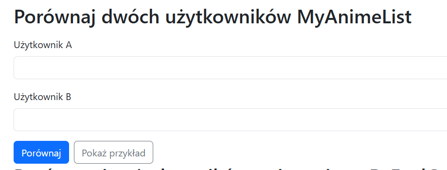
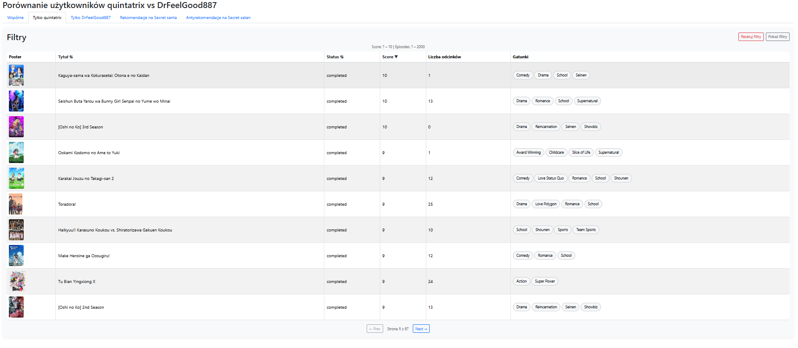
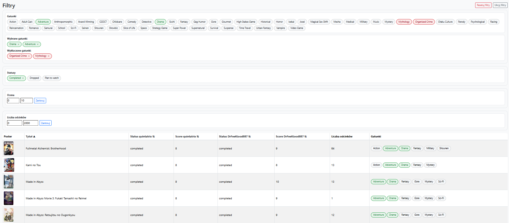
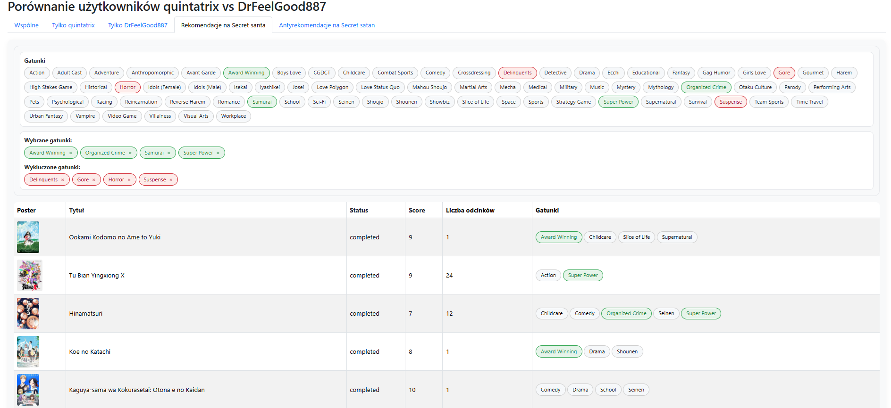

# Anime Compare     

Anime Compare is a web application built with Django that compares the anime lists of two MyAnimeList users and helps discover new series worth watching.

The application automatically synchronizes data from the MyAnimeList API, compares both users' libraries, provides advanced filtering options, and generates personalized recommendations based on users' ratings and genre preferences.

My main motivation was to build a tool that helps me find anime recommendations for a Secret Santa event in my Discord group.

---

## Features

- Compare two MyAnimeList users
- Automatic synchronization with the MyAnimeList API
- View common anime and titles unique to each user
- Interactive filtering without page reloads (HTMX)
- Filter by:
  - genres
  - watch status
  - score
  - number of episodes
- Sorting and pagination
- Simple recommendation system
- Anti-recommendation system
- Demo mode for users without a MyAnimeList account

---

## Hosting

[Website](https://malcompare.onrender.com/) is hosted by [render](https://render.com). May not be available after August 3, 2026.

---

## Screenshots

### Comparison form

### User list

### Filters

### Recommendations

---

## Recommendation Algorithm

Recommendations are generated from anime that User A has watched but User B has not.

The recommendation score is based on:

- User A's rating
- User B's automatically detected favourite genres
- User B's automatically detected disliked genres
- Manual genre preference adjustments

Genre preferences are calculated from User B's rating history while ignoring titles marked as *Plan to Watch*. Users can manually override these preferences using the interactive genre filters.

The recommendation algorithm is intentionally lightweight and fully explainable, making every recommendation easy to understand.

---

## Tech Stack

### Backend

- Python
- Django

### Frontend

- HTMX
- Bootstrap 5
- Vanilla JavaScript

### Database

- PostgreSQL

### External API

- MyAnimeList REST API

---

## Future Improvements

- Improve the recommendation algorithm
- Add English/Polish localization
- Anime similarity detection
- Recommendation explanations
- User statistics dashboard

---

## License

This project is available under the MIT License.